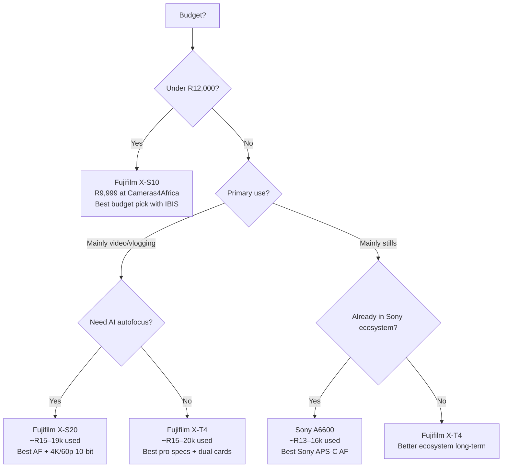

# Camera Buying Research: Second-Hand Value in South Africa
**Topic:** Sony A6500 vs A6600 vs Fujifilm X-S10 vs X-S20 vs X-T4  
**Focus:** Hobby/enthusiast photography — best value for money  
**Date:** March 2026  
**Currency:** South African Rand (ZAR) — approximate rate: R18–R19 per USD

---

## Executive Summary

For a South African hobby/enthusiast photographer buying second-hand, the **Fujifilm X-T4** offers the best overall value proposition in 2026. It delivers professional-grade specs (IBIS, 4K/60p 10-bit video, dual card slots, weather sealing) at a used price that undercuts newer alternatives. The **X-S10** is the best budget entry point into the Fujifilm ecosystem. Sony's A6600 remains competitive but the APS-C E-mount lens ecosystem is weaker and pricier than Fujifilm's X-mount for dedicated APS-C shooters.

---

## Second-Hand Price Estimates (South Africa, Early 2026)

Prices are estimated from local dealers (Cameras4Africa, WeBuyCamera), Gumtree/private sales, and international used markets (MPB) converted at ~R18.5/USD.

| Camera | SA Dealer Price (ZAR) | Private Sale / Gumtree (ZAR) | Int'l Used (USD) |
|---|---|---|---|
| Sony A6500 | R11,999 (Cameras4Africa) | R8,000–R11,000 | $500–$650 |
| Sony A6600 | ~R16,000–R18,000 (est.) | R13,000–R16,000 | $919–$984 |
| Fujifilm X-S10 | R9,999 (Cameras4Africa) | R8,000–R11,000 | $814–$899 |
| Fujifilm X-S20 | ~R18,000–R22,000 (est.) | R15,000–R19,000 | ~$950–$1,100 |
| Fujifilm X-T4 | ~R18,000–R22,000 (est.) | R15,000–R20,000 | $954–$1,229 |

> **Note:** SA prices carry a premium over international used markets due to import costs, limited local supply, and Rand weakness. Gumtree/Facebook Marketplace will yield the best prices but require in-person inspection. Cameras4Africa offers a 6-month warranty on all pre-owned gear — worth the premium for peace of mind.

---

## Camera-by-Camera Analysis

### Sony A6500 (2016)
- **Sensor:** 24.2MP APS-C BSI-CMOS
- **IBIS:** Yes — 5-axis (first Sony APS-C with IBIS)
- **Video:** 4K/30p (with overheating issues on long takes), 1080/120p
- **AF:** Older contrast/phase-detect hybrid — no Real-Time Tracking
- **Battery:** NP-FW50 (~350 shots) — weak by modern standards
- **Build:** Magnesium alloy, no weather sealing
- **Verdict:** Age is showing. Overheating in 4K, old AF, poor battery life. Only worth it at R8,000–R9,000 or below. The A6600 is a much better buy for a small price premium.

---

### Sony A6600 (2019)
- **Sensor:** 24.2MP APS-C BSI-CMOS (same as A6500)
- **IBIS:** Yes — 5-axis
- **Video:** 4K/30p (no overheating), 1080/120p
- **AF:** Real-Time Tracking with Eye/Animal AF — excellent
- **Battery:** NP-FZ100 Z-series (~720 shots) — excellent
- **Build:** Magnesium alloy, weather sealed
- **Pros:** Best-in-class AF for APS-C Sony, great battery, no overheating
- **Cons:** No 4K/60p, single card slot, no headphone jack on body (adapter needed), APS-C E-mount lens selection is limited/expensive
- **Verdict:** Solid camera but priced similarly to the X-T4 used, which offers more for video shooters. Best if you're already in the Sony ecosystem or prioritise AF tracking.

---

### Fujifilm X-S10 (2020)
- **Sensor:** 26.1MP X-Trans 4
- **IBIS:** Yes — 5-axis, up to 6 stops
- **Video:** 4K/30p, 1080/240p, F-Log, 10-bit via HDMI
- **AF:** Phase-detect with face/eye detection — good but not AI-class
- **Battery:** NP-W126S — modest (~325 shots)
- **Build:** Plastic body, no weather sealing
- **Pros:** Cheapest entry into Fujifilm X-mount with IBIS, compact, great image quality, film simulations
- **Cons:** No weather sealing, single card slot, smaller battery, no top-plate dials (PASM mode dial instead)
- **SA Price:** R9,999 at Cameras4Africa — best value entry point
- **Verdict:** Best budget pick. Ideal if you want Fujifilm colour science + IBIS without spending R18k+.

---

### Fujifilm X-S20 (2023)
- **Sensor:** 26.1MP X-Trans 5 (newer processor — X-Processor 5)
- **IBIS:** Yes — 7-stop (improved over X-S10)
- **Video:** 6.2K/30p, 4K/60p, 10-bit internal, F-Log2, USB-C streaming
- **AF:** AI subject detection (same as X-T5) — significant upgrade over X-S10
- **Battery:** NP-W235 (same as X-T4) — ~750 shots
- **Build:** Plastic body, no weather sealing
- **Pros:** Newest processor, best AF in this lineup, excellent video, big battery, vlog-friendly
- **Cons:** No weather sealing, single card slot, PASM dial (not classic Fuji dials), priced close to X-T4 used
- **Verdict:** Best for vloggers/content creators who want modern AF and video. But at similar used prices to the X-T4, the X-T4 offers more pro features (dual cards, weather sealing, better EVF, classic dials).

---

### Fujifilm X-T4 (2020)
- **Sensor:** 26.1MP X-Trans 4
- **IBIS:** Yes — 6.5-stop
- **Video:** DCI 4K/60p, 10-bit internal (4:2:0), 10-bit external (4:2:2), F-Log, 1080/240p
- **AF:** Phase-detect with face/eye detection — good, not AI-class
- **Battery:** NP-W235 — ~500 shots stills, ~90 min 4K video
- **Build:** Magnesium alloy, weather sealed (IPX4), dual UHS-II card slots
- **Screen:** Fully articulating vari-angle (unique advantage for video/vlogging vs X-T5's tilt screen)
- **Pros:** Pro build, dual cards, weather sealing, best video specs in this group, classic Fuji dials, large EVF
- **Cons:** Older AF (no AI subject detection), discontinued (used only), slightly bulkier
- **Verdict:** Best overall value for a serious enthusiast. Pro-spec body at a used price. The sweet spot for hybrid photo/video.

---

## Feature Comparison Matrix

| Feature | A6500 | A6600 | X-S10 | X-S20 | X-T4 |
|---|:---:|:---:|:---:|:---:|:---:|
| Sensor (MP) | 24.2 | 24.2 | 26.1 | 26.1 | 26.1 |
| IBIS | ✅ | ✅ | ✅ | ✅ | ✅ |
| IBIS stops | 5 | 5 | 6 | 7 | 6.5 |
| 4K/60p | ❌ | ❌ | ❌ | ✅ | ✅ |
| 10-bit internal | ❌ | ❌ | ❌ | ✅ | ✅ |
| AI AF (subject detect) | ❌ | ❌ | ❌ | ✅ | ❌ |
| Weather sealed | ❌ | ✅ | ❌ | ❌ | ✅ |
| Dual card slots | ❌ | ❌ | ❌ | ❌ | ✅ |
| Articulating screen | ❌ | ❌ | ✅ | ✅ | ✅ |
| Film simulations | ❌ | ❌ | ✅ | ✅ | ✅ |
| SA used price (est.) | R9–11k | R13–16k | R9–11k | R15–19k | R15–20k |

---

## Lens Ecosystem Analysis

This is a critical long-term cost factor. Lenses often cost more than the body over time.

### Fujifilm X-Mount
- **Native APS-C lenses:** 45 lenses (as of early 2026)
- **Philosophy:** Dedicated APS-C system — all lenses designed for the crop sensor
- **Budget options:** XC 15-45mm kit (~R3,500 used), XF 35mm f/2 (~R5,000 used), XF 18-55mm f/2.8-4 (~R6,000 used)
- **Mid-range:** XF 56mm f/1.2 (~R9,000 used), XF 16-80mm f/4 (~R10,000 used)
- **Third-party:** Sigma, Viltrox, Samyang all make X-mount lenses — good affordable options
- **Advantage:** Every lens is purpose-built for APS-C. No "crop tax" on full-frame glass.

### Sony E-Mount (APS-C)
- **Total E-mount lenses:** 72+ (but most are full-frame FE lenses)
- **Native APS-C (E) lenses:** Only ~15–20 dedicated APS-C lenses
- **Problem:** Sony's focus has shifted to full-frame. APS-C-specific lens development is slow.
- **Budget options:** E 18-135mm f/3.5-5.6 (~R7,000 used), E 35mm f/1.8 OSS (~R5,000 used)
- **Full-frame lenses on APS-C:** Work fine but are larger, heavier, and more expensive
- **Third-party:** Sigma, Tamron, Viltrox make E-mount lenses — helps fill gaps
- **Disadvantage:** To build a serious APS-C kit, you either use expensive full-frame glass or work with a limited native APS-C selection.

### Ecosystem Verdict

```
Fujifilm X-mount > Sony E-mount (APS-C)
```

For a dedicated APS-C shooter, Fujifilm's ecosystem is more purpose-built, better supported, and offers more choice at the APS-C price tier. Sony E-mount makes more sense if you plan to eventually move to full-frame (A7 series).

---

## Value Scoring (Hobby/Enthusiast Use)

Scored out of 10 across key criteria for a hobbyist/enthusiast:

| Criteria | A6500 | A6600 | X-S10 | X-S20 | X-T4 |
|---|:---:|:---:|:---:|:---:|:---:|
| Image quality | 7 | 7 | 8 | 8 | 8 |
| IBIS effectiveness | 7 | 7 | 8 | 9 | 8.5 |
| Video capability | 5 | 6 | 6 | 9 | 9 |
| AF performance | 5 | 9 | 7 | 9 | 7 |
| Build quality | 6 | 8 | 6 | 6 | 9 |
| Lens ecosystem (APS-C) | 6 | 6 | 9 | 9 | 9 |
| SA used price value | 7 | 7 | 9 | 7 | 8 |
| Future-proofing | 4 | 6 | 7 | 8 | 7 |
| **Total /80** | **47** | **56** | **60** | **65** | **65.5** |

---

## Decision Flowchart



---

## Recommendations by Use Case

### Best Overall Value → Fujifilm X-T4
Pro-spec body (weather sealed, dual cards, 4K/60p 10-bit, 6.5-stop IBIS) at a used price that's dropped significantly. The fully articulating screen is a bonus for video. Ideal for the enthusiast who wants a camera that won't limit them for years.

### Best Budget Pick → Fujifilm X-S10
At R9,999 from Cameras4Africa (with 6-month warranty), this is the cheapest way into a modern IBIS-equipped mirrorless with Fujifilm's colour science. Great for travel, street, and everyday photography.

### Best for Vlogging/Content Creation → Fujifilm X-S20
The newest processor, AI AF, 4K/60p 10-bit internal, and USB-C streaming make it the most modern option. Worth the premium over the X-S10 if video is a priority.

### Best AF Tracking → Sony A6600
If you shoot sports, wildlife, or fast-moving subjects and want the best tracking AF in this price range, the A6600's Real-Time Tracking is still excellent. But consider the weaker APS-C lens ecosystem.

### Avoid → Sony A6500
Too old, too many compromises (overheating, weak battery, old AF) for the current asking price. Only worth it under R8,000.

---

## Where to Buy in South Africa

| Source | Pros | Cons |
|---|---|---|
| [Cameras4Africa](https://www.cameras4africa.co.za) | 6-month warranty, graded condition, free shipping | Higher prices than private sale |
| [WeBuyCamera](https://www.webuycamera.co.za) | Johannesburg-based, buy/sell/trade | Smaller Fujifilm stock |
| Gumtree.co.za | Cheapest prices | No warranty, inspect in person |
| Facebook Marketplace | Good local deals | Scam risk, no buyer protection |
| MPB (international) | Graded, reliable | Import duties, shipping costs, currency risk |

---

## Key Takeaways

1. **The X-T4 is the sweet spot** — pro features at a used price that's hard to beat in 2026
2. **Fujifilm's X-mount ecosystem is better** for dedicated APS-C shooters than Sony's E-mount
3. **The X-S10 at R9,999** is the best entry point if budget is tight
4. **Sony A6500 is aging out** — avoid unless the price is very low
5. **SA prices carry a ~20–30% premium** over international used markets — factor this in
6. **Buy from Cameras4Africa** for warranty protection, or Gumtree for best price (inspect carefully)

---

## Sources

- [Cameras4Africa — Pre-owned Sony Mirrorless](https://www.cameras4africa.co.za/collections/pre-owned-sony-mirrorless-cameras) — Live SA pricing (A6500: R11,999)
- [Cameras4Africa — Pre-owned Fujifilm Mirrorless](https://www.cameras4africa.co.za/collections/pre-owned-fujifilm-mirrorless-cameras) — Live SA pricing (X-S10: R9,999)
- [MPB Used Fujifilm X-T4](https://www.mpb.com/en-us/product/fujifilm-x-t4) — International used: $954–$1,229
- [MPB Used Fujifilm X-S10](https://www.mpb.com/en-us/product/fujifilm-x-s10) — International used: $814–$899
- [MPB Used Sony A6600](https://www.mpb.com/en-us/product/sony-alpha-a6600) — International used: $919–$984
- [MPB Used Sony A6500](https://www.mpb.com/en-us/product/sony-alpha-a6500/sku-3111454) — International used: $624–$699
- [Fujifilm X-T4 in 2026 — Buyer's Guide](https://eathealthy365.com/fujifilm-x-t4-in-2025-the-ultimate-buyer-s-guide/) — Feature analysis and used pricing
- [Sony A6500 2025 Market Reality](https://www.wimarys.com/sony-a6500-settings-tips-tricks/) — Updated pricing and honest assessment
- [Lens Ecosystem Guide 2026](https://gearorbit.com/posts/how-to-choose-a-lens-ecosystem-in-2026) — Mount comparison data
- [Memeburn — X-T4 SA launch price](https://memeburn.com/gearburn/2020/02/fujifilm-x-t4-south-africa-price/) — Historical SA pricing context
